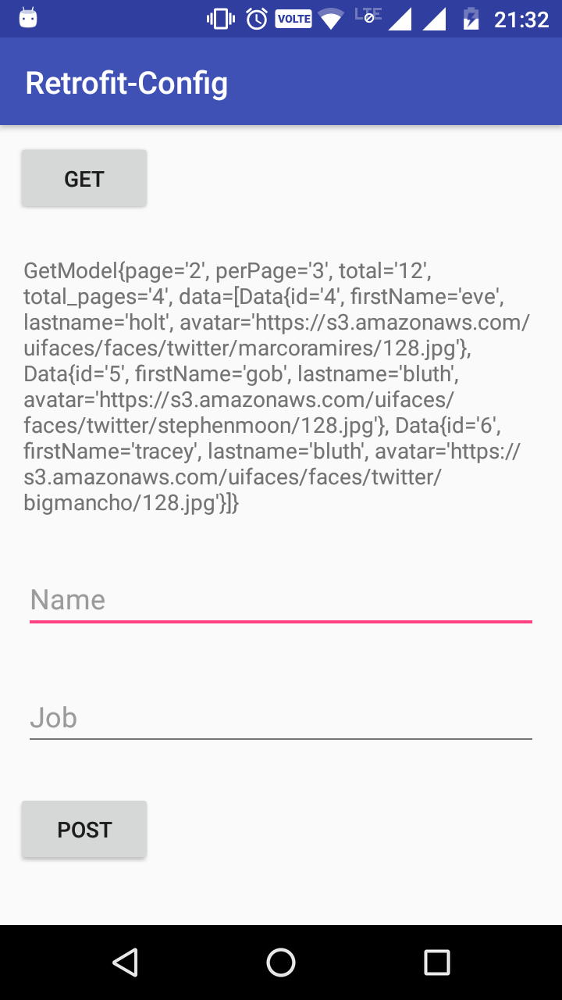
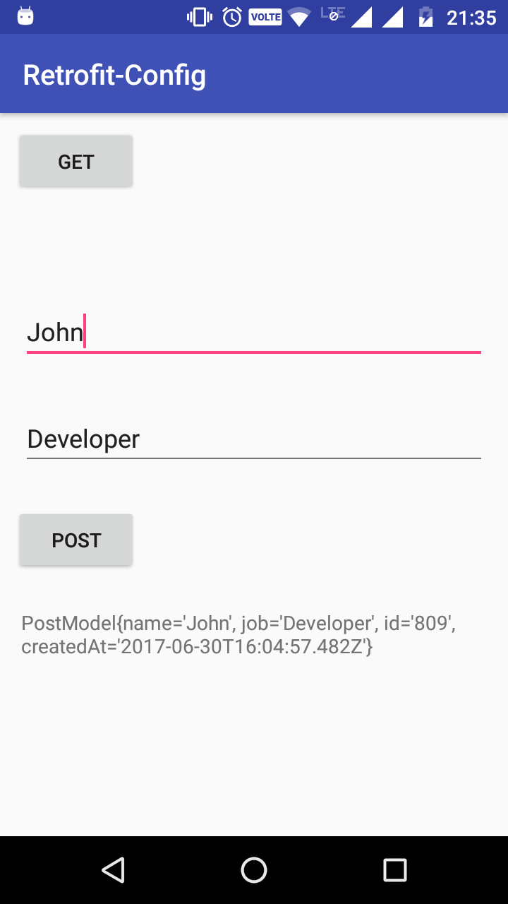

# retrofit_config

A sample android application that contains a configuration for Retrofit2. Retrofit is a rest client for android. It is fast and very easy to setup.

A sample GET request and a POST request are shown.

Before running the app please make sure you have an internet connection in order to avoid any roadblocks.

## Screenshots

